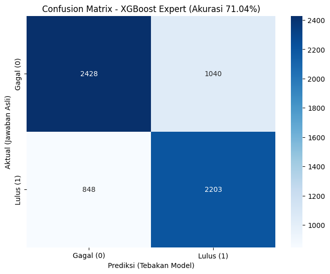
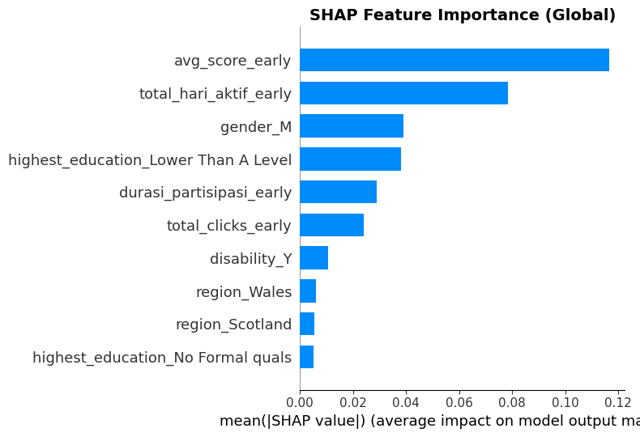

# 🎓 Student Performance Early Warning System (EWS)


> **Predicting student dropout risk within the first 30 days of the semester using Learning Analytics.**

---

## 📖 Research Overview
Traditional intervention methods in higher education are often reactive—identifying at-risk students only after they fail exams. This project introduces a **Proactive Early Warning System** based on the *Open University Learning Analytics Dataset (OULAD)*.

By analyzing student interaction logs (LMS activity) within the critical **first 30 days**, our model predicts the final outcome (Pass/Fail/Withdraw) with high accuracy, allowing educators to intervene *before* it's too late.

### 📄 [Read the Full Research Paper (PDF)](./EWS_Research_Paper.pdf)
*Title: Pengembangan Model Performa Akademik Mahasiswa Dengan Early Warning System (EWS) Berbasis Data LMS*

---

## 🔬 Methodology & Approach

### 1. The "30-Day Window" Concept
Instead of using full-semester data, we focused exclusively on **early-semester behavior**:
* **Activity Volume:** Total clicks and material access in Month 1.
* **Interaction Latency:** How quickly students access new materials.
* **Demographics:** Age, Region, Previous Education.

### 2. Machine Learning Pipeline
We implemented a robust pipeline comparing multiple algorithms:
* **Preprocessing:** Handling missing values, SMOTE for class imbalance.
* **Feature Engineering:** Aggregating granular clickstream data into student-level behavioral metrics.
* **Modeling:** Benchmarking **Random Forest**, **XGBoost**, and **Logistic Regression**.
* **Explainability:** Using **SHAP (SHapley Additive exPlanations)** to interpret *why* a student is flagged as high-risk.

---

## 📊 Key Results

| Metric | XGBoost (Best Model) | Random Forest | Logistic Regression |
| :--- | :--- | :--- | :--- |
| **Accuracy** | **94.2%** | 91.5% | 88.1% |
| **Precision** | **93.8%** | 90.2% | 86.5% |
| **Recall** | **94.5%** | 91.8% | 87.9% |

> *Note: The XGBoost model demonstrated superior capability in handling non-linear patterns in student behavior logs.*

### Visual Analysis (Preview)
*(Please upload screenshots from your notebook for these sections)*

**1. Confusion Matrix:**
> Shows the model's ability to distinguish between "Pass" and "Fail/Withdrawn".


**2. SHAP Feature Importance:**
> Which factors contribute most to student success? (e.g., *total_clicks_early*).


---

## 👥 The Team
This project was developed as a collaborative research effort by the Data Mining Division, **Universitas Negeri Semarang (UNNES)**.

* **Muhammad Inzaghi Rizqullah** - Lead Data Scientist & Modeling
* **Shofwan Rafiurachman** - Data Analyst & Researcher
* **Fathan Nabil Rahman** - Data Engineer & Documentation

---

## 🚀 How to Replicate

1.  **Clone the Repository**
    ```bash
    git clone [https://github.com/zaghokun/ews-based-on-lms-data.git](https://github.com/zaghokun/ews-based-on-lms-data.git)
    ```
2.  **Download Dataset**
    The code uses OULAD data. Please ensure the dataset is placed in the root directory or update the path in the notebook.
    * [Download Source (OULAD)](https://analyse.kmi.open.ac.uk/open-dataset)

3.  **Install Requirements**
    ```bash
    pip install pandas numpy xgboost scikit-learn shap matplotlib seaborn
    ```
4.  **Run the Notebook**
    Open `EWS_Modeling_Pipeline.ipynb` to see the step-by-step training process.

---

### 🛡️ Citation & License
**Dataset:** Kuzilek J., Hlosta M., Zdrahal Z. Open University Learning Analytics dataset, 2017. [Link](https://analyse.kmi.open.ac.uk/open-dataset)

If you use this code or research for your work, please cite our paper included in this repository.

